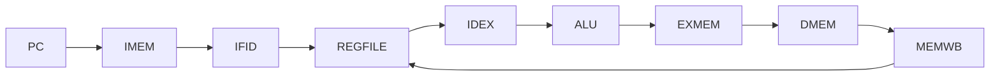
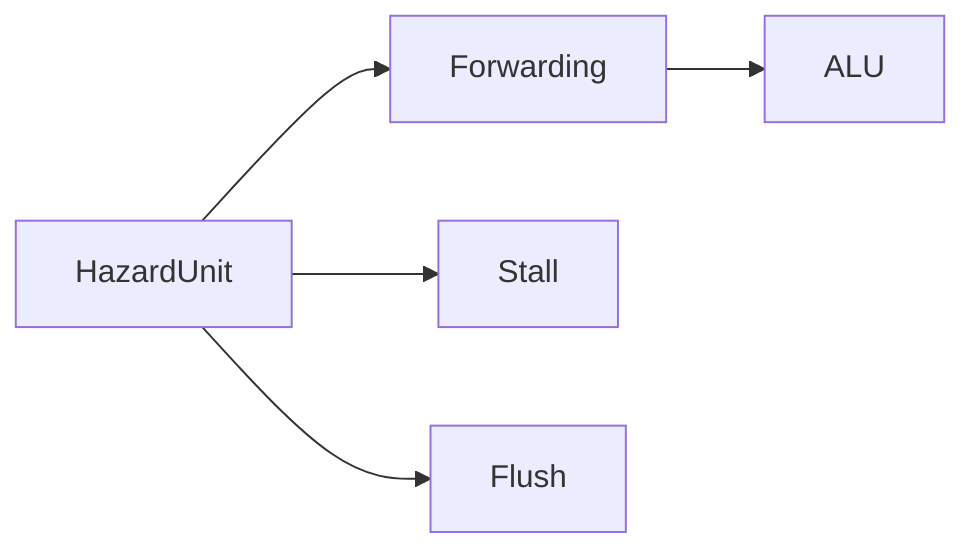

<h1 align="center"> RISC-V RV32I 5-Stage Pipeline Processor (RTL to GDSII) </h1>

<p align="center">


</p>

---

# Introduction

RISC-V is an open-source Instruction Set Architecture (ISA) that enables flexible and efficient processor design.  In this project, we implement a **RV32I 5-stage pipelined processor** in Verilog and integrate it with the **OpenROAD flow** for complete ASIC design (RTL → GDSII).

Unlike a single-cycle processor, this design improves performance by executing multiple instructions simultaneously using pipelining.

---

# Disadvantages of Single-Cycle Processor

Although simple, the single-cycle architecture has major limitations:

### Long Critical Path
- Entire instruction executes in one clock cycle  
- Clock period determined by slowest instruction (e.g., load)

### Low Clock Frequency
- Cannot operate at high speed due to long combinational delay  

### No Parallelism
- Only one instruction executes at a time  

### Poor Hardware Utilization
- ALU, memory, and registers remain idle for most of the cycle  

### Not Scalable
- Difficult to extend for advanced architectures  

---

# Reference (Previous Work)

We have already implemented a **Single-Cycle RISC-V Processor** with full ASIC flow:

👉 https://github.com/rajesh042005/RISC-V-RV32I-Processor---Verilog-RTL-to-GDSII  

This pipelined design is an **advanced extension** of that work, improving performance and architectural efficiency.

---

# 5-Stage Pipeline Architecture


---

# Pipeline Stages
## 1. Instruction Fetch (IF)
- PC generates instruction address
- Instruction fetched from memory
- PC updated using:
  - PC + 4
  - Branch / Jump target

## 2. Instruction Decode (ID)
- Instruction decoded into fields
- Register file read (RS1, RS2)
- Immediate generation
- Control signals generated

## 3. Execute (EX)
- ALU performs operations
- Branch condition evaluated
- Target address calculated

## 4. Memory (MEM)
- Load and store operations
- Data memory accessed

## 5. Write Back (WB)
- Result written back to register file
- Source selected from:
- ALU result
- Memory data
- PC + 4

---

# Pipeline Datapath


---

# Pipeline Registers (From Implementation)

## IF/ID Register

- Instruction
- PC, PC+4
- Supports Stall and Flush

##ID/EX Register

- Register operands
- Immediate
- Control signals
- Branch logic

## EX/MEM Register

- ALU result
- Write data
- Control signals

## MEM/WB Register
- Memory data
- ALU result
- Destination register

---

# Hazard Handling (Core Highlight)

## Data Hazards

### Forwarding (Bypassing)
- EX/MEM → EX
- MEM/WB → EX
- Implemented using:
  - ```ForwardAE```
  - ```ForwardBE```

### Load-Use Hazard
- Detected using:
  - ```ResultSrcE```
  - Register dependencies
- Solution:
  - StallF, StallD
  - FlushE

## Control Hazards
- Branch resolved in Execute stage
- On branch taken:
  - Flush Decode stage
  - Flush Execute stage

---

# Pipeline Timing Concept

| Cycle | IF | ID | EX | MEM | WB |
| ----- | -- | -- | -- | --- | -- |
| 1     | I1 |    |    |     |    |
| 2     | I2 | I1 |    |     |    |
| 3     | I3 | I2 | I1 |     |    |
| 4     | I4 | I3 | I2 | I1  |    |
| 5     | I5 | I4 | I3 | I2  | I1 |

---

# Stall & Flush Mechanism
## Stall
- Freezes:
  - PC
  - IF/ID register
## Flush
- Inserts bubble (NOP)
- Clears incorrect instruction

---

# Outputs

## Final GUI


## CTS


## Klayout


## Reports

- **Synthesis Report**
  - Cell count        : finish__design__instance__count__stdcell: 19432
  - Area utilization  : finish__design__instance__utilization": 0.468527

- **Timing Reports**
  - Worst Slack (Setup/Hold)  
    - finish__timing__setup__ws : 17.4793
    - "finish__timing__hold__ws : 0.0849638
  - Total Negative Slack (TNS)  
    - finish__timing__setup__tns : 0
    - finish__timing__hold__tns  : 0


- **CTS Report**
  - Buffer count  : finish__design__instance__count__class:clock_buffer : 535
  - Clock skew  
    - finish__clock__skew__setup : 0.0175597
    - finish__clock__skew__hold  : 0.0175597

- **Routing Report**
  - DRC violations  
    - finish__flow__warnings__count      : 0
    - finish__flow__errors__count        : 0
    - finish__flow__warnings__type_count : 0

---

## Key Metrics (Post-Layout)

- Standard Cell Area ≈ **35468.2 µm²**  
- Total Cells ≈ **~45.7K**  
- Clock Period = **10.0 ns (~400 MHz)**  
- Setup Slack ≈ **17.2 ns**  
- Hold Slack ≈ **-0.085 ns**  
- DRC Violations = **0**  

---

<p align="center"><b> This project demonstrates a transition from a basic single-cycle processor to a high-performance pipelined architecture, showcasing strong digital design and VLSI backend skills. </b></p>

---


